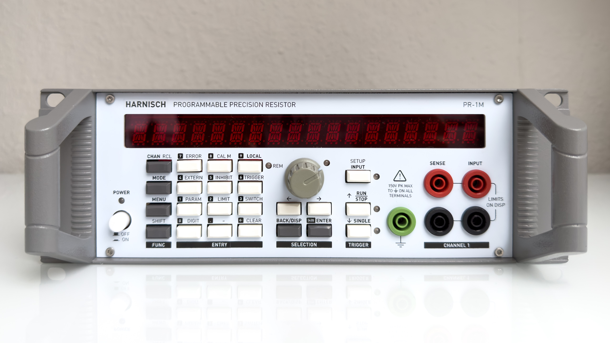
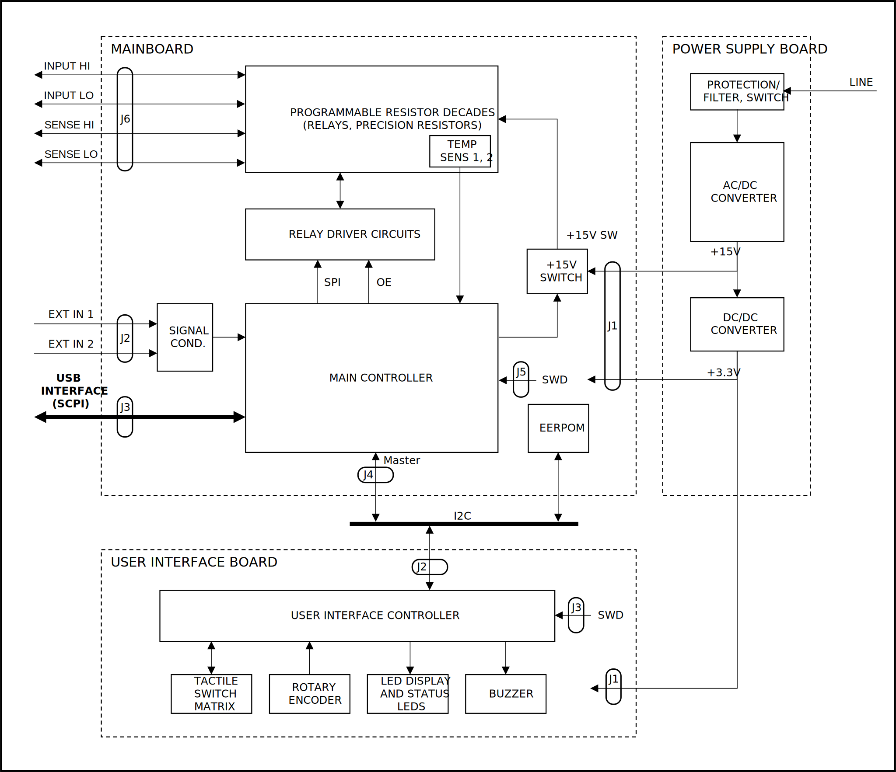
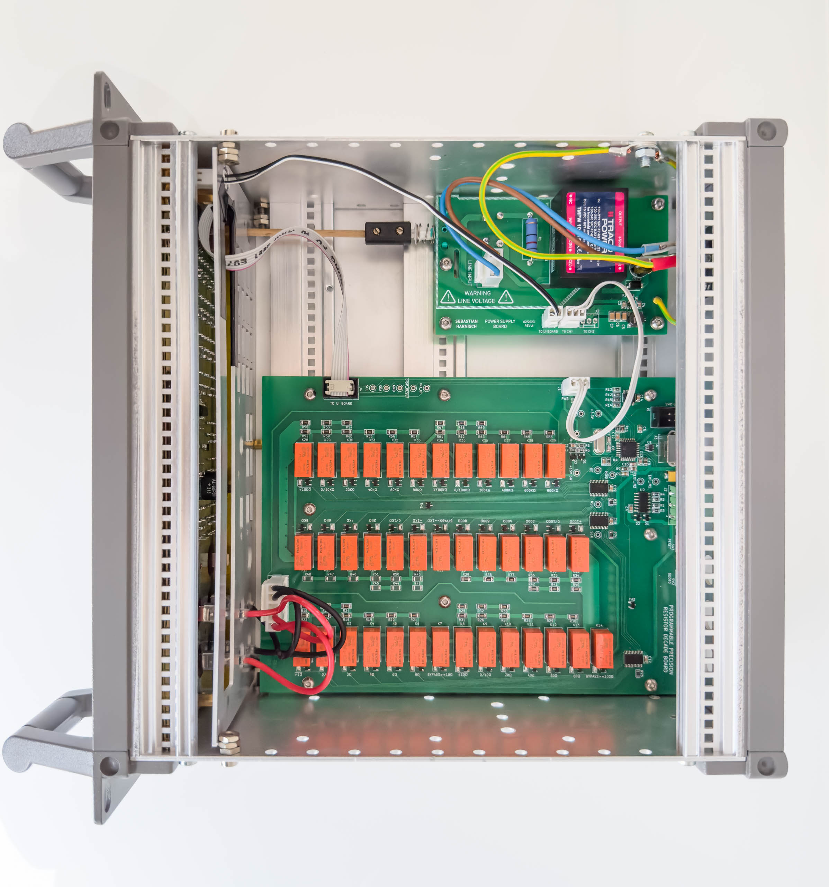
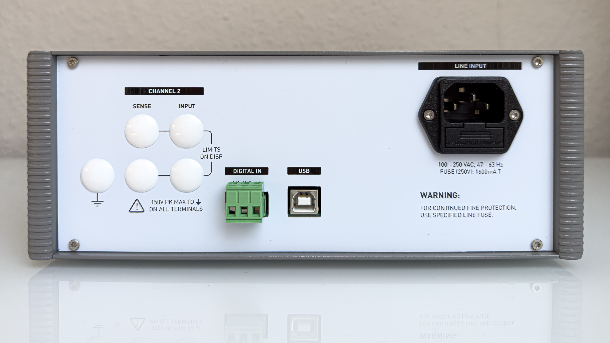
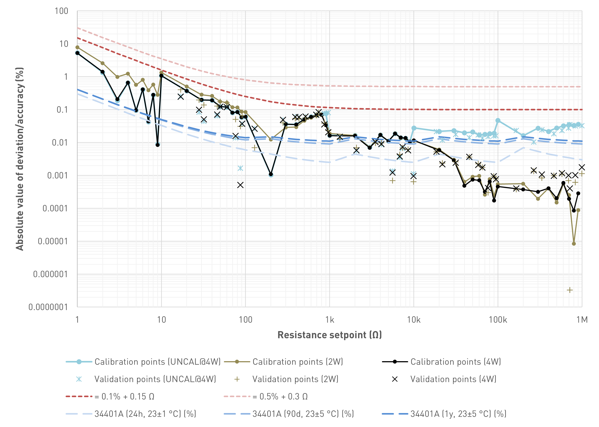

# Progammable Precision Resistor

A SCPI programmable precision resistor

**WARNING:** The programmable power resistor presented here is mains powered. On the power supply board there will be mains/line voltage. Working with/on such devices can lead to damage, injury or death. Don't do it if you're not qualified or authorized to do so. You use the circuits described at you own risk. You might operate the mainboard and ui board more safely with a bench or external power supply.

## Background and motivation

In 2021/2022 I designed a DC electronic load that would be more capable, but also much more complex than the usual DIY solutions. However, after building a working breadboard prototype of the analog circuitry with 12 ICs including multiple precision and dual opamps, I thought that it might be better to start with a smaller project that would allow me to gain a lot of experience and write much of the non-application specific code that I could use later on for the digital part. Also, at the time I was looking for a decade resistor box to add to my lab. And this is how I started working on a programmable decade resistor, a pretty specialized tool for niche applications.

## Introduction

A programmable resistor is a electronic device whose electrical resistance can be adjusted typically through digital signals. Programmable resistors are available in form of integrated circuits (often referred to as digital potentiometers) as well as stand-alone devices/expansion cards. There are many different applications, each with their own set of requirements e. g.:

programmable gain amplifiers
sensor emulation, e. g. for integration tests with hardware-in-the-loop simulators
automated testing
calibrators
prototyping
Basic concept
The programmable resistor closely follows the main principle of resistor decade boxes: connecting multiple devices (“decades”) in series, with each of the devices having a settable resistance of 0 Ω, 1 ⋅ 10^n Ω, 2 ⋅ 10^n Ω, 9 ⋅ 10^n Ω, where n specifies the decade in question.

Those devices are simple resistor networks complemented by one (multi-throw) or more (single- or multi-throw) switches. While the actual topology and resistor values vary vastly, the switch(es) will always either short out or connect certain resistors or simply tap certain nodes of the resistor network. A simple implementation uses a 10-throw rotary switch to tap the nodes of a series resistor network of nine resistors.

## Features

| Parameter                                | Value / Description                                                                                                                                                                                                                                                                                                                                                                                                                                       |
| :--------------------------------------- | :-------------------------------------------------------------------------------------------------------------------------------------------------------------------------------------------------------------------------------------------------------------------------------------------------------------------------------------------------------------------------------------------------------------------------------------------------------- |
| Range                                    | short circuit, 1 Ω … 999.999 kΩ, open circuit                                                                                                                                                                                                                                                                                                                                                                                                          |
| Setpoint resolution                      | 1 Ω                                                                                                                                                                                                                                                                                                                                                                                                                                                      |
| Short-term setpoint accuracy estimate    | <=±0.1% of value + 0.15 Ω (2W and 4W). The estimate is based on measurements for a limited number of calibration and validation resistance setpoints. The measurements were performed with an older Agilent 34401A 6.5 digit multimeter for a single DUT. This is NOT a valid strategy to get reliable/reproducible results in the sense of a specification. It's just a more or less plausible envelope based on measurements I took for my prototype. |
| Display value resolution                 | 6.5 digits, 5.5 digits, 4.5 digits, 3.5 digits, but not better than 1 mΩ                                                                                                                                                                                                                                                                                                                                                                                 |
| Short-term display accuracy estimate     | <=±0.01% + 0.025 Ω (2W and 4W). This figure is meant to show how much the displayed resistance value (that is based on a calibration) deviates from the value shown on the DMM, the calibration has been performed with.                                                                                                                                                                                                                                |
| Thermal drift (estimate based on design) | <<50 ppm/K                                                                                                                                                                                                                                                                                                                                                                                                                                                |
| Power rating                             | >=0.2W for decade 0 (0..9Ω), >=0.5W else Exact value depends on setpoint (display)                                                                                                                                                                                                                                                                                                                                                             |
| Bandwidth                                | unspecified                                                                                                                                                                                                                                                                                                                                                                                                                                               |
| Calibration modes                        | - Uncalibrated: Switches are activated according to entered setpoint, display shows setpoint - Two-wire (2W), Four-wire (4W): An internal setpoint is calculated based on the calibration values to reduce the error (effects changes for higher resistance values only)                                                                                                                                                                             |
| Operating modes                          | Fixed: On trigger no change Step: On trigger step to trigger setpoint value Up: On trigger increase setpoint (linearly, 1-2-3-4-5-6-7-8-9, 1-2-5, 1-3) Down: On trigger increase setpoint (linearly, 1-2-3-4-5-6-7-8-9, 1-2-5, 1-3) List: See list mode                                                                                                                                                                               |
| List mode                                | Up to 100 values with individual dwell times - Start: on trigger; or immediately after mode selection - Step:   - Auto: Advance index automatically, solely based on dwell time   - Trigger: Advance index on each trigger event, ignoring the dwell time   - Once: Advance index on each trigger event, only after dwell time elapsed                                                                                           |
| Switching                                | fast (default), break-before-make                                                                                                                                                                                                                                                                                                                                                                                                                         |
| Trigger                                  | Source: Bus, External (Rising, Falling, Either), Immediate, Manual, Timer; Mode: Continuous, Single Parameter: Delay, Holdoff, Time (Source: Timer)                                                                                                                                                                                                                                                                                             |
| Inhibit                                  | Inhibit the input - Latching: Latch input on/off on inhibit input change - Live: Switch input on/off according to present inhibit input state                                                                                                                                                                                                                                                                                                   |
| Command and trigger execution            | 10ms loops                                                                                                                                                                                                                                                                                                                                                                                                                                                |
| User interface                           | - 18 digit alphanumeric display:   - Primary display: Resistance setpoint   - Secondary display: Input state, max. current at setpoint, max. voltage at setpoint, max. power at setpoint, hardware setpoint   - Menu-based - 6 dual color LEDs - Rotary encoder with push button - 23 additional push buttons                                                                                                               |
| User presets                             | 0-9; 0 is loaded on power-up                                                                                                                                                                                                                                                                                                                                                                                                                              |
| Interface                                | - USB - Two digital inputs, settable polarity (positive, negative) and function (trigger, inhibit, readout)                                                                                                                                                                                                                                                                                                                                          |
| Power supply                             | Switch mode                                                                                                                                                                                                                                                                                                                                                                                                                                               |

## System design

The block diagram provides an overview of the different circuit groups of each functional block, their internal connections and external interfaces. The Programmable Decade Resistor consists of three main functional blocks:

1. Power supply (Power Supply Board)
2. Programmable decades, control and driver circuits (Mainboard)
3. User Interface (User Interface Board)

The power supply board uses an off-the-shelve AC/DC converter to provide a +15V rail. The +15V rail powers the relays on the mainboard as well as a DC/DC converter. A single DC/DC converter generates a +3.3V supply for both the mainboard and the UI board, including the LED display. The power rails are earth-referenced. (Nevertheless, the inputs of the Programmable Decade Resistor are floating thanks to the isolation of the relays.)

The mainboard’s main controller contains the business logic to control the relays, read the external inputs and run the USB and user interfaces. The main controller communicates with the User Interface Board over I2C which handles the multiplexing of the alphanumeric LED display, scans the switch matrix, decodes the signals of the rotary encoder and drives the buzzer.

## Results

After the final calibration the results are in. The first diagram shows the absolute value of the deviation between the setpoint and the value indicated by the Agilent 34401A multimeter. Connecting lines between data points for visual purposes only.

The second diagram shows the absolute value of the deviation between the calculated resistance (estimate based on calibration values) and the value indicated by the Agilent 34401A multimeter. Connecting lines between data points for visual purposes only

## About this repository

This repository contains the PCB design files used in this project. If you'd like to have a look at the interactive bom files you can do so here:

- Mainboard: [HTML Preview of interactive BOM](https://htmlpreview.github.io/?https://github.com/sbstnh/programmable_precision_resistor/blob/main/pcb/mainboard/bom/ibom.html)
- UI board: [HTML Preview of interactive BOM](https://htmlpreview.github.io/?https://github.com/sbstnh/programmable_precision_resistor/blob/main/pcb/ui_board/bom/ibom.html)
- Power Supply Board: [HTML Preview of interactive BOM](https://htmlpreview.github.io/?https://github.com/sbstnh/programmable_precision_resistor/blob/main/pcb/power_supply/bom/ibom.html)

## Further information

More details are available at [https://hackaday.io/project/191969-programmable-precision-resistor](https://hackaday.io/project/191969-programmable-precision-resistor) and on my personal site [https://sebastianharnisch.de](https://sebastianharnisch.de).

## Firmware and License

The firmware was created with STM32CubeIDE and uses code auto-generated by or provided with the IDE, including
- the HAL library, code related to the USB device and other code
- FreeRTOS

Further more, this project uses a SCPI parser library that can be found here: [https://github.com/j123b567/scpi-parser](https://github.com/j123b567/scpi-parser)

Most of the auto-generated code as well as the libraries are not included here.
Therefore it is recommended to use STM32CubeIDE to create a project for the target device, with the USB device software and FreeRTOS enabled, add the required SCPI library and adapt the code according to the requirements.

For the code not included in this repository the respective licenses will apply instead of the license specified in this repository.

I DO NOT guarantee that the code provided is free of bugs (see LICENSE file for more details).
